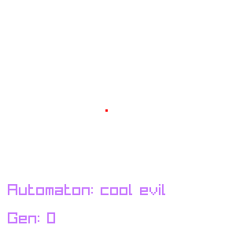
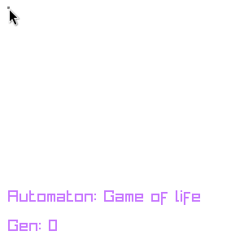
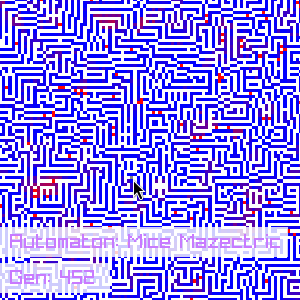
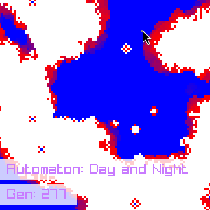

# Game_of_life
a small implementation of a Cellular Automaton simulation engine, created out of boredom.

## Preview

  
  

  
  

## Features

- Implemented the logic for any 2D automata.
- Implemented additional cellular automata.
- Optimized the logic with techniques such as bit manipulation.
- Autoplay feature with generation display.
- Zoom and move functionality for easy navigation and examination of large grids.
- Ability to change between different rulesets.
- Planned optimizations include parallel processing and hot reload for development.

## Implementation Details

The simulation engine is written in C, utilizing raylib for graphics rendering. The core logic is optimized using bit manipulation techniques to improve performance, especially for large grids.

## Installation

1. Clone the repository.
2. Build the project with `make`.
3. Run with `./main`.

## Usage

1. Press spacebar to start/stop the simulation.
2. Press H for a help menu.

## To-do 
- [x] actually implement the logic for Conway's Game of Life.
- [ ] Further optimize the logic, including parallel processing.
    - [ ] Investigate parallel processing for performance enhancements.
    - [x] Utilize bit manipulation for improved efficiency.
- [x] autoplay and show gen
- [x] add more cool Cellular automata
- [x] add a way to change between the rules.
- [ ] hot reload for development? (Literally no reason other than it's a cool idea)
- [ ] add functionality to export simulations as GIFs or static images.
- [ ] implement controls for adjusting simulation rules dynamically during runtime.
- [ ] Implement features like customizable color schemes.
- [ ] add support for 1D automata
- [ ] adjust simulation parameters such as speed, cell size, and grid size.
